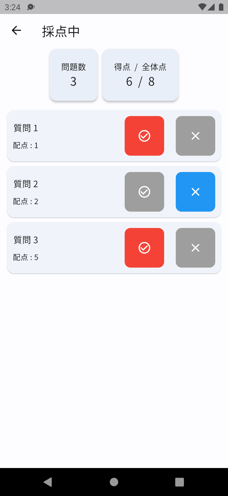

# Score counter SCCO

 

SCCO is mobile/web app to count test score for school teachers, students, and all studying people.

## Getting Started

For android app

## How to use

You can know how to use to click [here](https://snova301.github.io/AppService/score_counter/home.html).

Google Play and the Google Play logo are trademarks of Google LLC.
